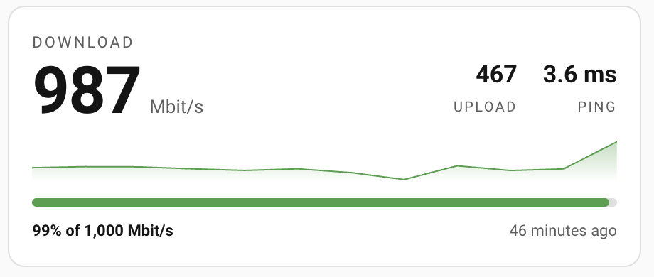
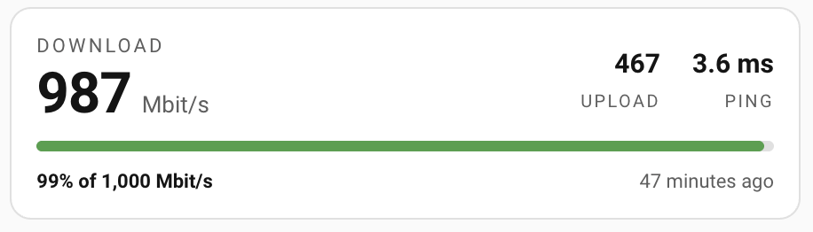
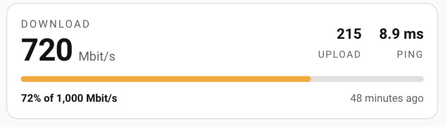

# SpeedTest Compact Card

[![hacs][hacs-badge]][hacs-url]
[![release][release-badge]][release-url]
[![license][license-badge]](LICENSE)

A compact Home Assistant dashboard card for internet speed sensors: one big number, a bar
showing **how much of your line you actually get**, a sparkline and a stale-data warning.



## Why another speedtest card

Most cards show you a number. `519 Mbit/s` means nothing on its own — is that good? It depends
entirely on what you pay for.

This card compares every measurement against **your line's nominal speed** and draws the ratio
as a bar that changes colour on its own. A half-filled amber bar tells you in a glance what a
raw number hides: you are getting half of your connection. That is the whole point of the card,
and it is what makes the difference between "the internet feels slow" and "I have a problem,
and here is the proof".

## Features

- **One dominant figure** — download is the value that moves; upload and latency sit beside it,
  small, because they rarely change.
- **Share-of-line bar** — filled proportionally to your plan, green / amber / red on
  configurable thresholds.
- **Sparkline** — inline SVG, area shaded in the current colour, no charting library.
- **Staleness warning** — the age of the last measurement turns red when the test stops running.
  A speedtest that silently dies is worse than no speedtest at all.
- **Responsive** — shrinks to a single grid row without clipping: the type scales down and
  secondary elements step aside.
- **Full visual editor** — every option is configurable from the UI, grouped in sections.
- **Theme-aware** — built on Home Assistant CSS variables, so it follows light and dark mode.
- No dependencies, no build step, ~12 KB.

## Installation

### HACS (recommended)

1. In HACS, open the three-dot menu and choose **Custom repositories**.
2. Add `https://github.com/sleepyraptor/homeassistant-speedtest-compact-card` with category
   **Dashboard**.
3. Install **SpeedTest Compact Card**.
4. Reload your browser with a hard refresh (`Ctrl/Cmd + Shift + R`).

### Manual

1. Download `speedtest-compact-card.js` from the [latest release][release-url].
2. Copy it into `config/www/`.
3. Add the resource under **Settings → Dashboards → ⋮ → Resources**:
   `/local/speedtest-compact-card.js`, type **JavaScript module**.
4. Hard refresh the browser.

## Configuration

Add the card from the picker (**SpeedTest Compact**) and use the visual editor, or write YAML.

**No option has a hidden default except the labels.** If you leave a field empty, the
corresponding element is not drawn — nothing is invented behind your back.

| Option | Type | Default | Description |
|---|---|---|---|
| `type` | string | — | `custom:speedtest-compact-card` |
| `down` | entity | **required** | Download speed. The big figure and the source of the graph. |
| `up` | entity | — | Upload speed. If empty, the block is not drawn. |
| `ping` | entity | — | Latency. If empty, the block is not drawn. |
| `last` | entity | — | Timestamp of the last test. If empty, the age indicator disappears. |
| `label_down` | string | `Download` | Caption above the big figure. |
| `label_up` | string | `Upload` | Caption under the upload value. |
| `label_ping` | string | `Ping` | Caption under the latency value. |
| `unit` | string | `Mbit/s` | Unit shown next to the big figure. |
| `unit_ping` | string | `ms` | Unit shown next to the latency. |
| `max_down` | number | — | Nominal line speed, the full scale of the bar. If empty, bar and percentage disappear. |
| `ok_pct` | number | `80` | Above this share of the line the bar is green. |
| `warn_pct` | number | `60` | Above this share the bar is amber; below it, red. |
| `footer` | string | `{pct}% of {max} {unit}` | Text under the bar. Supports `{pct}`, `{max}`, `{unit}`. |
| `sparkline` | boolean | `false` | Show the graph. When off, the card does not even reserve its space. |
| `days` | number | — | Days of history in the graph. |
| `stale_hours` | number | — | Hours without a measurement before the age turns red. |

### Full example

```yaml
type: custom:speedtest-compact-card
down: sensor.speedtest_download
up: sensor.speedtest_upload
ping: sensor.speedtest_ping
last: sensor.speedtest_last_test
label_down: Download
label_up: Upload
label_ping: Ping
unit: Mbit/s
unit_ping: ms
max_down: 1000
ok_pct: 75
warn_pct: 50
footer: "{pct}% of {max} {unit}"
sparkline: true
days: 7
stale_hours: 2.2
```

### Minimal example

```yaml
type: custom:speedtest-compact-card
down: sensor.speedtest_download
max_down: 1000
ok_pct: 75
warn_pct: 50
```

## Without the graph

Turn `sparkline` off and the card does not merely hide the chart, it stops reserving its space:
two rows of content, nothing else.



And the same card on a bad day. Nothing was reconfigured between these two shots — only the
line got worse, and the card says so before you have read a single digit:



## How it behaves

### Sizing

The card declares its own grid options and adapts to the height you give it in the layout
editor:

| Height | Layout |
|---|---|
| 3 rows or more | Full: 46 px figure, graph, bar, footer |
| 2 rows | 32 px figure, tighter padding, compressed graph |
| 1 row | 22 px figure, captions and footer step aside, graph hidden |

### Colours

The bar colour comes from `ok_pct` and `warn_pct`, applied to the *ratio* between the current
value and `max_down` — not to the absolute value. The sparkline is drawn in the same colour, so
a degraded line is visible before you read a single digit.

### Language

The card follows the user's Home Assistant language, per user — not a global card setting.

Relative times and number formats come from the browser's own `Intl` APIs, so `12 minutes ago`
becomes `12 minuti fa` and `5.3 ms` becomes `5,3 ms` without any translation file. Only one word
needs a dictionary — *never*, shown when a measurement has never arrived.

The footer is deliberately **not** translated: `{pct}% of {max} {unit}` is a technical string,
and only the numbers inside it follow the locale. Write your own `footer` to say it any other
way, in any language.

### Redraws

Home Assistant assigns `hass` to every card on every state change in the house. This card
compares the state objects of *its own* entities and repaints only when one of them actually
changed, so a light switching on does not redraw it. A one-minute timer keeps the age indicator
moving on its own, and is cleared when the card leaves the page.

## Limitations

- **The graph is bound by your recorder retention.** `days: 60` will not draw sixty days if
  `purge_keep_days` is 10 — the history simply does not exist. For longer ranges, use a
  `statistics-graph` card against long-term statistics.
- **The card reads sensors, it does not run speedtests.** Any source works: the Speedtest.net
  integration, an MQTT publisher, a router-scraped sensor. The entities are yours to provide.
- Latency is shown but never colour-coded: a plausible ping tells you little, and an implausible
  one is already obvious.

## Contributing

Issues and pull requests are welcome. The card ships as a single dependency-free file,
`dist/speedtest-compact-card.js`, and there is no build step — edit it and hard refresh.

Tests run against a real DOM (`happy-dom`) with Node's built-in runner, and cover rendering,
the colour thresholds, the optional blocks, staleness, localisation, the redraw guard and the
editor schema:

```bash
npm install
npm test
```

Every push and every tag runs them in CI, together with `node --check` and HACS validation. A
semver tag (`1.0.0`, no `v` prefix) also publishes a release with the card attached.

## License

[MIT](LICENSE)

[hacs-badge]: https://img.shields.io/badge/HACS-Custom-41BDF5.svg
[hacs-url]: https://github.com/hacs/integration
[release-badge]: https://img.shields.io/github/v/release/sleepyraptor/homeassistant-speedtest-compact-card
[release-url]: https://github.com/sleepyraptor/homeassistant-speedtest-compact-card/releases
[license-badge]: https://img.shields.io/badge/license-MIT-blue.svg
